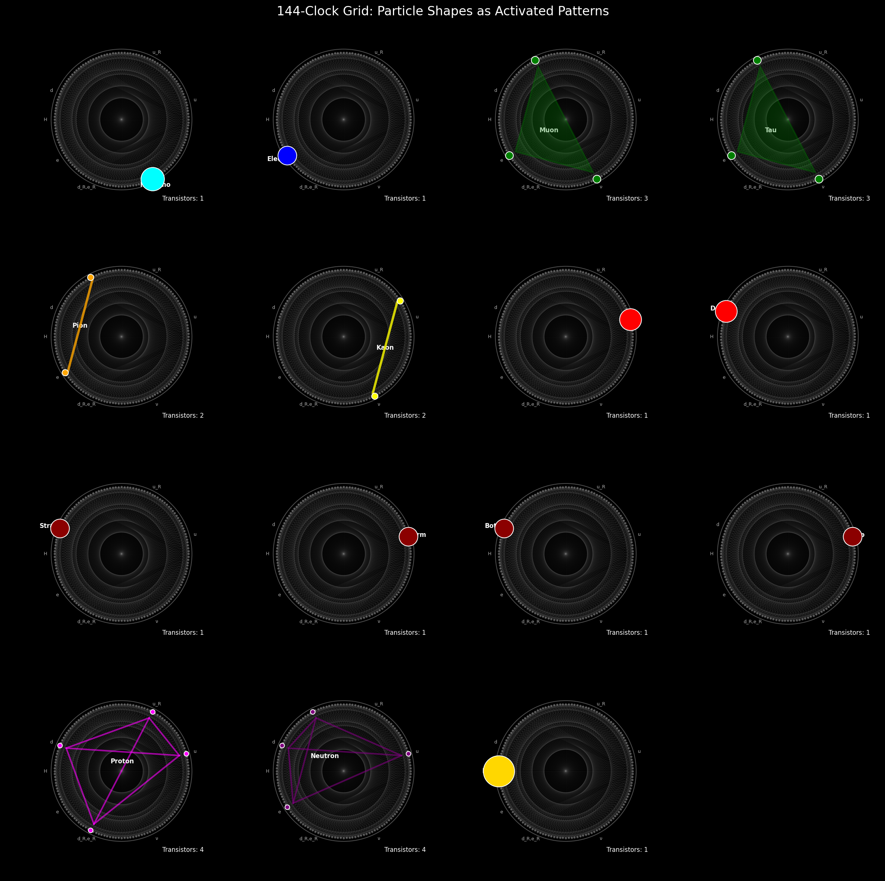
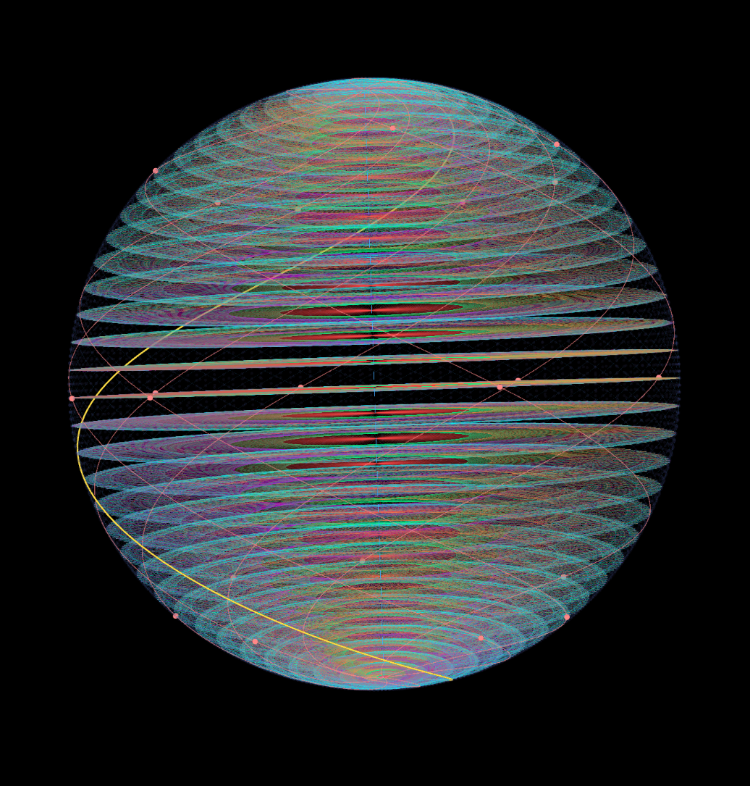
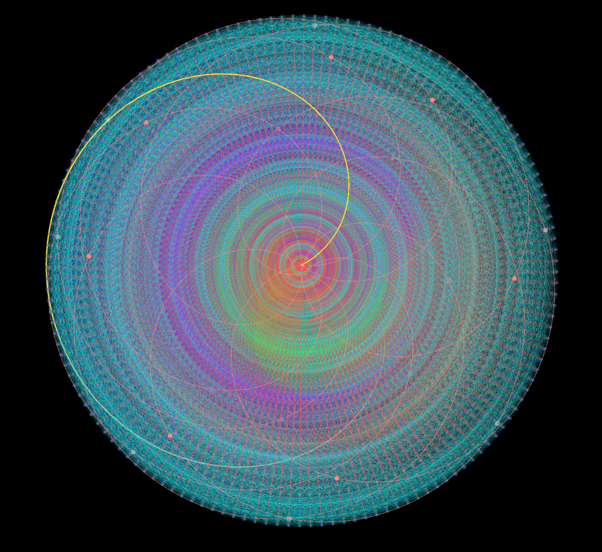
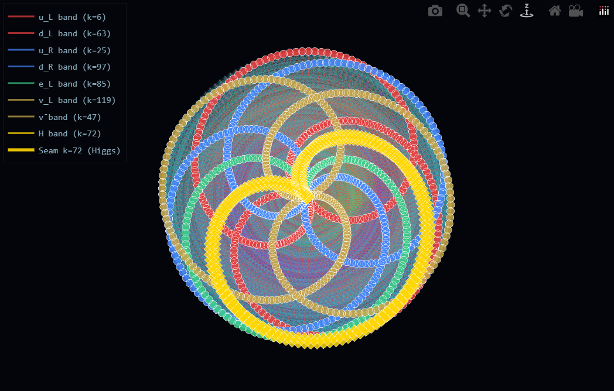
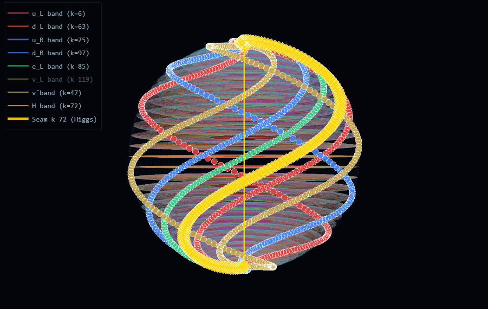
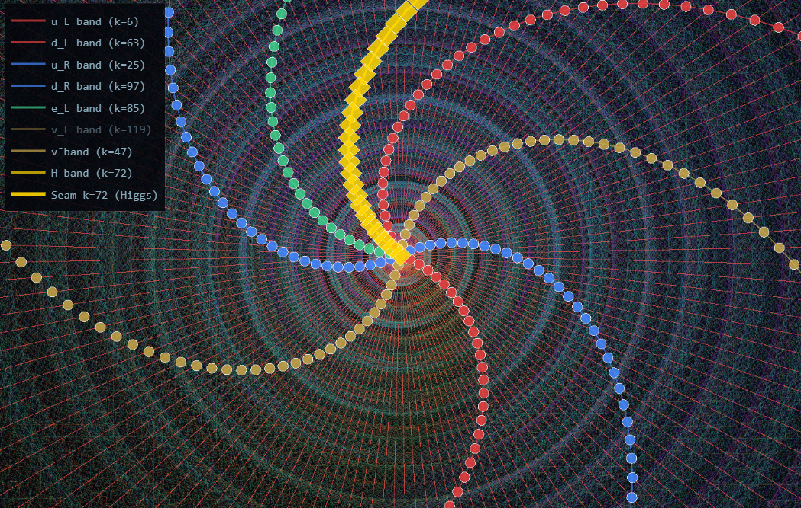
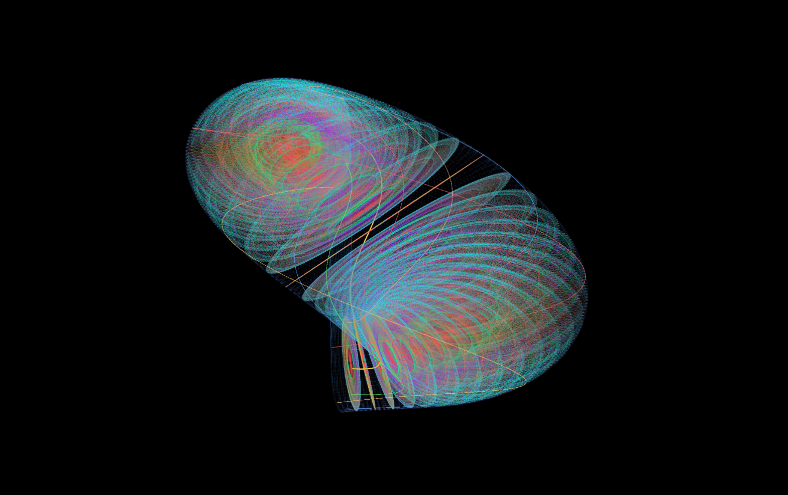
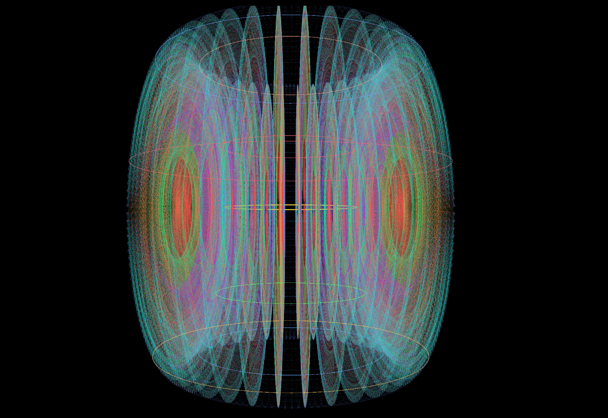
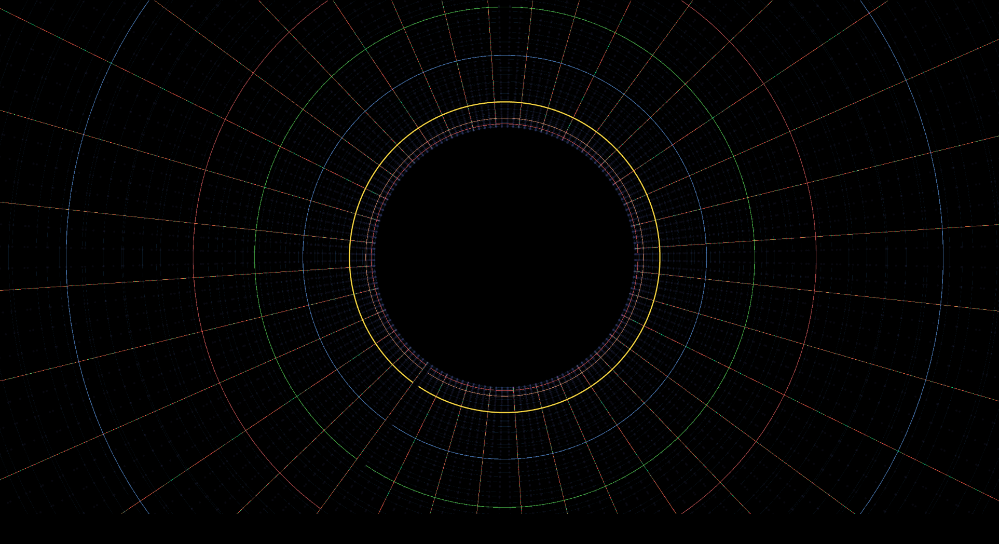

# O.CLOCK Visualizations

All images on this page are geometric consequences of the 144-clock's arithmetic structure — not illustrations of physical claims, but honest renderings of the mathematics.

Interactive HTML models are in this folder. Download and open in any modern browser.

---

## 144-Clock: Colored Gauge Arcs

The 144-clock with all Standard Model fermion positions labeled and gauge arcs color-coded by interaction type. The 144 points of the clock are arranged around the circumference. Fermion positions are marked as colored dots: yellow (Higgs/seam at k=72), red (left-handed quarks), blue (right-handed quarks), green (leptons). Gauge arcs connect clock positions at specific arithmetic distances (Δk), each color representing a different gauge interaction: cyan (Z lepton, Δk=12), yellow-green (Z up, Δk=19), orange (Z down, Δk=34), purple (gluon, Δk=48), green (W⁺, Δk=57), pink (seam/Higgs, Δk=72). The concentric spiral structure reflects the clock's modular arithmetic. The bright central point emerges from arc convergence — a geometric consequence of the chord structure, not an artifact.

---

## 144-Clock Grid: Particle Shapes as Activated Patterns

A grid of 144-clock visualizations showing individual Standard Model particles and composite particles as activated positions and arc patterns. Each panel shows the same 144-clock background with specific clock positions and connections highlighted.

Row 1 — Leptons by generation: Neutrino (single cyan dot, k=119), Electron (single blue dot, k=85/97), Muon (green triangle, Transistors: 3), Tau (green triangle, same positions, Transistors: 3). The muon and tau occupy the same clock positions as the electron — generation is not encoded in position.

Row 2 — Mesons: Pion (orange line, Transistors: 2), Kaon (yellow line, Transistors: 2), Up quark (red dot), Down quark (red dot).

Row 3 — Heavier quarks: Strange, Charm, Bottom, Top — each shown as a single red dot.

Row 4 — Baryons and Higgs: Proton (magenta polygon, Transistors: 4), Neutron (magenta polygon, Transistors: 4), Higgs (single yellow dot at k=72, the seam).

The "Transistors" count reflects the number of active clock connections for each particle.

---

## Sphere of Clocks — Side View

The sphere of clocks viewed from the side. The 144-clock, rotated 144 times through 360°, produces a sphere of 20,736 points. Each horizontal band corresponds to a fermion's clock position — visible as distinct latitude rings around the sphere. The yellow curve traces the seam path (k=72, Higgs) from pole to pole. Pink dots mark fermion positions. The bands are a direct consequence of fermion clock positions, not an artistic choice.

---

## Sphere of Clocks — Polar View

The sphere of clocks viewed from the polar axis. The full gauge arc structure is visible as a dense interference pattern spiraling inward toward the center. The yellow curve marks the seam arc. Pink dots mark fermion positions around the circumference. The bright central point emerges from the convergence of arc chords — a genuine geometric property of the structure.

---

## Sphere — Exterior Polar Close-up

View from outside the sphere looking in toward the pole. The radial lines are gauge arcs converging toward the seam position at the polar axis. Concentric rings are successive clock rotations stacked along the sphere's surface. The yellow curve is the seam path (k=72). The bright red center marks the convergence point where arc density is highest.

---

## Sphere — Interior Polar Close-up

View from inside the sphere looking outward toward the pole. The gauge arc grid is visible from within, giving a tunnel-like appearance. The yellow seam path sweeps away from the viewer toward the pole. The regular grid is the full gauge arc lattice seen from inside — connections between clock positions at fixed Δk intervals extending outward in all directions.

---

## Sphere — Interior Angle View

View from inside the sphere near the core, looking outward at an angle toward the pole. The seam path (yellow curve) sweeps across the field of view, crossing the vertical seam axis (dotted red line). The concentric rings are the gauge arc lattice converging at the pole seen from below and to the side. The purple and green interference patterns are the full gauge arc structure seen from within. Small pink dots mark fermion positions along the seam path.

---

## Sphere — Core View

View from the core of the sphere, looking along the equatorial plane. The bright red horizontal band is the equatorial ring where the seam position (k=72) traces its path at maximum density. The blue vertical line is the polar axis. The yellow line is the seam path crossing through the core. The red convergence point at their intersection is the geometric center of the structure.

---

## Sphere Particles — Polar View

Polar view of the sphere with Standard Model fermion bands highlighted. Each colored ring traces one fermion class at its specific clock position: bright red (uL, k=6), dark red (dL, k=63), bright blue (uR, k=25), dark blue (dR, k=97), green (eL, k=85), dark gold (νL, k=119), light gold (antineutrino, k=47), yellow (Higgs seam, k=72). The rings sit at distinct radii because each fermion's clock position maps to a different poloidal angle. The Higgs seam forms the largest central ring — a direct consequence of k=72 being the half-clock point.

---

## Sphere Particles — Side View

Side view of the sphere with fermion bands visible as colored spirals winding from pole to pole. The yellow vertical line is the Higgs seam axis (k=72). Each fermion class traces a distinct helical path — the spiral shape is a direct geometric consequence of the construction: as the clock rotates through 144 steps, each fixed k-position traces a helix.

---

## Sphere Particles — Interior View

View from inside the sphere looking outward toward a pole, with fermion band paths visible as colored dot sequences spiraling outward. The yellow seam path (k=72) is the bold central track. Red quarks, blue quarks, green leptons, and gold neutrinos are visible as distinct spiral arms. Each class occupies a distinct arm determined entirely by its clock position k.

---

## Sphere to Torus Transition

The sphere of clocks mid-transition toward a torus geometry. As the construction parameters shift, the sphere's poles fold inward and the structure takes on a toroidal shape. The two lobes correspond to the two halves of the sphere separating around the equatorial seam. The yellow and orange lines are the seam path during the transition.

---

## Torus — Particle Rings

The 144-clock structure in torus projection, viewed from the side. Each fermion's spiral path on the sphere becomes a perfect ring on the torus, sitting parallel to the others along the central axis. The yellow seam ring (k=72, Higgs) runs through the center. Different clock positions map to rings at different radii, making the chirality separation between fermion classes spatially visible.

---

## Torus — Interior View

View from inside the torus looking outward. The concentric colored rings are fermion path rings visible from within the structure. The yellow ring is the Higgs seam. The black void at center is the hole of the torus. The radial lines extending outward are gauge arc connections between ring positions.

---

## Interactive Models

Download and open in any modern browser — no installation required.

**sphere_of_clocks.html** — 3D interactive sphere of clocks (20,736 points). Also exhibits hypersphere-like structure as an emergent geometric property.

**sphere_to_torus_morph.html** — Interactive visualization of the sphere transitioning to a torus. Fermion spiral paths become perfect parallel rings as the geometry shifts.

---

*Part of the O-Theory Collaborative Project · [oscriptcollective/O.CLOCK](https://github.com/oscriptcollective/O.CLOCK)*
